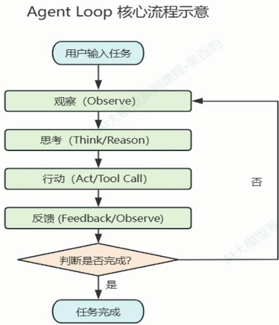

# ai loop engineering or prompt engineering? 
- agent loop 智能体循环

- prompt engineering 提示词工程
- loop engineering 并非替代prompt engineering，而是更好的利用它

## prompt engineering
人->写prompt->llm回答->人读结果->不满意再写prompt....
问题:
- 每次都要人进行介入
- 复杂的多步骤任务需要人手动拆解
- 人无法24小时不间断盯着
- 上下文窗口长度有限 长对话可能会失忆

## loop engineering
人->设计loop(目标+触发条件+验证标准+退出条件)
- loop自动执行
  - 发现任务

## loop engineering
- 什么是 loop engineering?
-  

# 开始一个loop engineering工程
- 1. Trigger
 - cron
 - webhook
 - deamon
- 2. file structure
 - artifacts
 - loop contract
 - docs
 - logs.md
- 3.tools
 - skills
 - workflow
 - mcp
- 4.verify
 - codebase harness
 - git worktree
 - /verify
 - 
