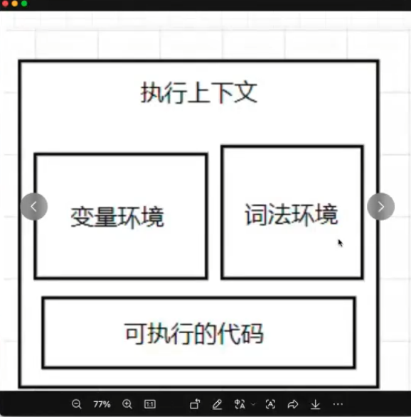
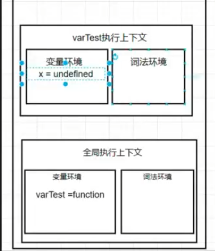

# js执行机制
- 变量环境
  function 、var
- 词法环境
  let、const
- 执行的代码 
  从上到下 顺序执行
- 上面三者都在执行上下文对象中  
- 调用栈
  v8引擎用来管理函数之间的调用关系的一种数据结构
  - 编译总发生在执行的前一刻
  - 全局和函数体的编译会生成执行上下文 存入调用栈中 
  - 当一个函数执行完毕后 它所在的执行上下文就会被销毁 从调用栈中弹出
  1. 代码进入执行阶段，创建全局执行上下文
  2. 创建变量环境，函数声明提升，变量声明提升
  3. 创建词法环境，let、const不提升
  4. 执行代码

## 编译的过程
- 生成执行上下文对象
~~~js
fn 的执行上下文对象：
{
    变量环境: {          // 存 var 声明的变量和函数
        age: undefined   // 先提升，后赋值
    },
    词法环境: {          // 存 let/const 声明的变量
        // TDZ 暂时性死区
    },
    this: window,        // this 指向谁
    outer: 全局上下文    // 作用域链，找不到变量往哪找
}
~~~
- 找形参和变量声明，将形参和声明的变量名作为key，值为undefined存入变量环境中 -- 寻找声明和赋值的过程是分开的
- 统一形参和实参的值(全局没有这个步骤 )
- 然后找函数声明，将函数名作为key，值为函数对象存入变量环境中
<!-- - 词法环境中不提升，暂时性死区 -->

## 总结
执行上下文对象--编译阶段诞生 先编译再执行
js执行流程
读取代码-->编译阶段（变量环境、词法环境、this、作用域链）--> 执行阶段（执行代码）
调用栈
负责管理函数之间的调用关系 

## let const
词法环境支持块级作用域
仍然使用栈来管理不用的作用域的变量
调用栈是执行上下文的容器
栈顶指针 指向当前正在执行的函数/全局
let const 不能重复声明 变量提升
暂时性死区 dead zone TDZ 都是为之前js的缺陷而设计的
